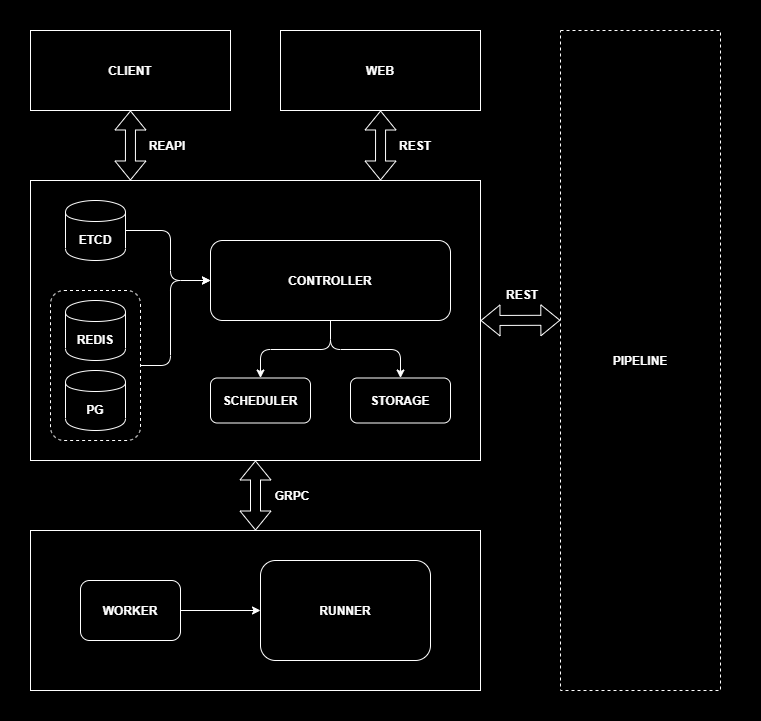

# Introduction

## Overview

distbuild executes processes locally on the system on which  it is run and also caches the results of those processes locally as  well. Besides this "local execution" mode of operation, distbuild also supports two distributed modes of operation:

- "Remote caching" where distbuild stores results from local process execution in a remote cache and also consumes results from that remote cache

- "Remote execution" where distbuild offloads execution of processes to a remote server (and consumes cached results from that remote server)

distbuild does this by using the "Remote Execution API" to converse with the remote cache or remote execution server.

